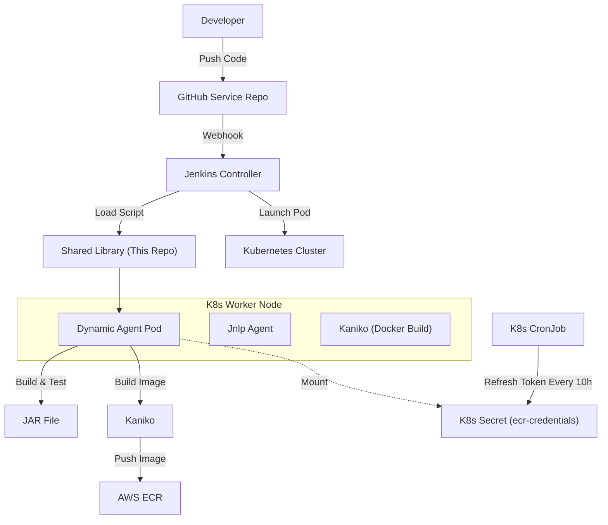

# JIAA Project CI/CD Infrastructure

> **한 줄 정의**
> Jenkins Shared Library와 Kubernetes(EKS)를 활용하여, 5개 마이크로서비스의 빌드/배포 파이프라인을 중앙에서 표준화하여 관리하는 인프라 저장소입니다.

## 🏗 Architecture (구조)

GitHub Organization의 모든 저장소를 Jenkins가 자동 스캔하며, 실제 빌드는 Kubernetes Pod에서 격리된 환경으로 수행됩니다.



## 🚀 Repository Structure
이 저장소는 파이프라인 로직(`vars`)과 쿠버네티스 리소스(`resources`, `k8s`)로 구성됩니다.

```plaintext
.
├── vars/
│   └── jiaaServicePipeline.groovy   # [Core] 모든 서비스가 사용하는 메인 파이프라인 로직
├── resources/
│   └── pod-templates/
│       └── kaniko-pod.yaml          # [Agent] 빌드 시 동적으로 생성되는 K8s Pod 명세
└── k8s/
    └── ecr-cronjob.yaml             # [Infra] AWS ECR 토큰 자동 갱신용 CronJob (10시간 주기)
```

## 🛠 Features (주요 기능)
**Centralized Management (중앙 관리)**
개별 서비스(`user-service`, `auth-service` 등)의 Jenkinsfile을 수정할 필요 없이, 이 저장소의 `jiaaServicePipeline.groovy`만 수정하면 전사 배포 로직이 업데이트됩니다.

**Dynamic Build Agents (동적 에이전트)**
빌드할 때마다 깨끗한 컨테이너(Pod)를 생성하고 빌드 후 삭제하므로, 환경 오염이 없고 병렬 빌드가 가능합니다.

**Secure Image Build (Kaniko)**
Docker-in-Docker 방식 대신 Kaniko를 사용하여, Root 권한 없이 안전하게 컨테이너 이미지를 빌드하고 ECR에 푸시합니다.

**Auto Token Refresh (자동 인증)**
12시간마다 만료되는 AWS ECR 토큰 문제를 해결하기 위해, K8s CronJob이 10시간마다 자동으로 시크릿을 갱신합니다.

## 💻 How to Use (사용 가이드)
새로운 마이크로서비스를 추가하거나 기존 서비스에 CI를 적용하려면, 해당 리포지토리의 `Jenkinsfile`에 딱 3줄만 작성하세요.

**Jenkinsfile Template**
```groovy
// 1. 라이브러리 로드 (Jenkins Global Configuration에 'jiaa-lib'으로 등록되어 있어야 함)
@Library('jiaa-lib') _

// 2. 파이프라인 실행
jiaaServicePipeline()
```
> **Note:** `appName`을 별도로 명시하지 않으면, Git Repository 이름을 자동으로 서비스명으로 사용합니다.

## ⚙️ Infrastructure Setup (운영자용)
이 파이프라인이 정상 동작하기 위해서는 Kubernetes 클러스터에 다음 설정이 선행되어야 합니다.

### 1. ECR 인증 토큰 갱신 봇 (CronJob)
AWS ECR 접속 토큰 유효기간(12h) 문제를 해결하기 위해 `ecr-registry-helper`가 반드시 실행 중이어야 합니다.

**설치 방법:**
```bash
# 1. AWS IAM User 권한이 담긴 Secret 생성 (최초 1회)
# (보안상 로컬 터미널에서 직접 수행)
kubectl create secret generic aws-secret \
  --from-literal=access-key='<YOUR_ACCESS_KEY>' \
  --from-literal=secret-key='<YOUR_SECRET_KEY>' \
  -n cicd

# 2. CronJob 배포
kubectl apply -f k8s/ecr-cronjob.yaml
```

**상태 확인:**
```bash
kubectl get cronjob -n cicd
kubectl get secret ecr-credentials -n cicd  # AGE가 최신인지 확인
```

### 2. Jenkins Global Library 설정
Manage Jenkins > System > Global Pipeline Libraries

* **Name:** `jiaa-lib`
* **Default version:** `main`
* **Repository URL:** `https://github.com/JIAA-Project/jiaa-ci-library.git`

## 📝 Trade-off (의사결정 배경)
* **GitHub Actions vs Jenkins:** 복잡한 배포 로직 제어와 K8s 클러스터 내부 자원 활용(비용 절감)을 위해 Jenkins를 선택했습니다.
* **Kaniko 도입:** K8s 클러스터 내에서 보안상 위험한 privileged 모드(Docker Socket Binding)를 피하기 위해 Kaniko를 도입했습니다.
